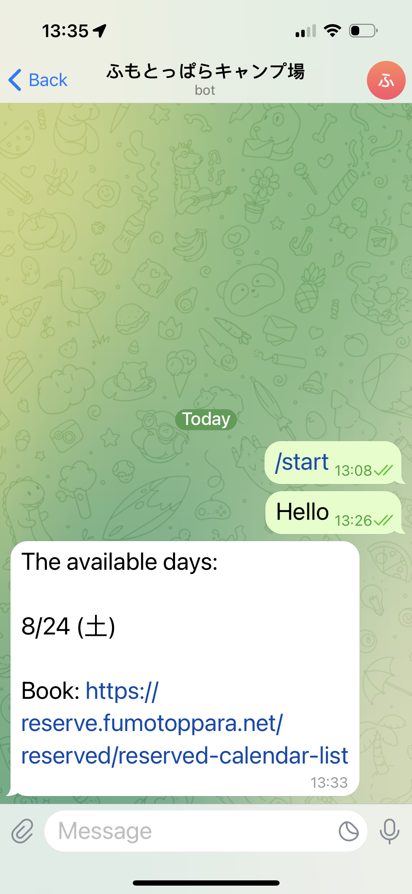

# ふもとボット

ふもとっぱらキャンプ場は土曜日に空いていますか？

[](./LICENSE)

## Usage

1. Send a message to https://t.me/fumoto_bot
2. Wait the bot reply when available days was found.



## Develop

install

```sh
npm install
```

crawl

```
npm start
```

send message to telegram

```
export TELEGRAM_TOKEN=<token>

npm run send:telegram
```

## Author

👤 **Thaddeus Jiang**

- Website: https://thaddeusjiang.com/
- Twitter: [@ThaddeusJiang](https://twitter.com/ThaddeusJiang)
- Github: [@ThaddeusJiang](https://github.com/ThaddeusJiang)

## Show your support

Give a ⭐️ if this project helped you!

## Refs

- https://reserve.fumotoppara.net/reserved/reserved-calendar-list
