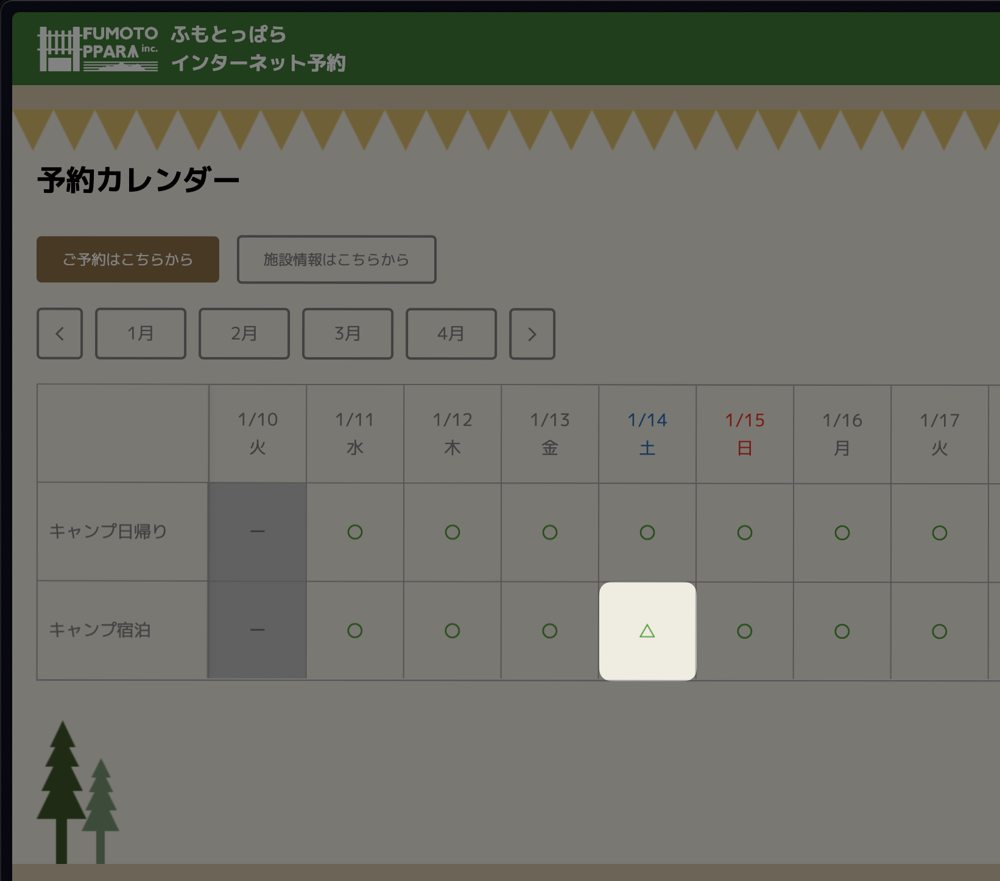
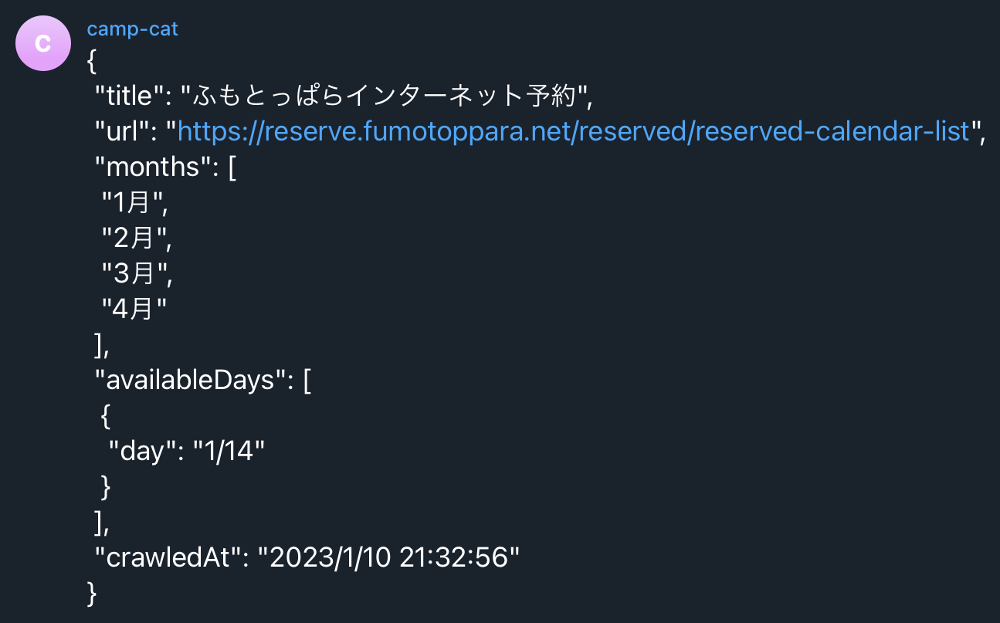

# Camp Crawler

from:


to:


## Usage

```
npm install

npm start
```

## Telegram Integration

```
export TELEGRAM_TOKEN=<token> TELEGRAM_CHAT_ID=<chat_id>

npm run send:telegram
```

## Scheduled Runner

[GitHub Actions](./.github/workflows/preview.yml)

## Crawlee + PlaywrightCrawler + TypeScript project

This template is a production ready boilerplate for developing with `PlaywrightCrawler`. Use this to bootstrap your projects using the most up-to-date code.

If you're looking for examples or want to learn more visit:

- [Documentation](https://crawlee.dev/api/playwright-crawler/class/PlaywrightCrawler)
- [Examples](https://crawlee.dev/docs/examples/playwright-crawler)
