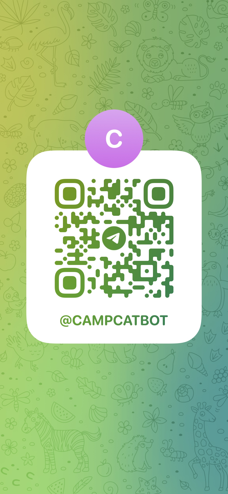

# Camp Cat

[](#)
[](https://twitter.com/ThaddeusJiang)

> Crawl camp sites and alert the available Saturdays.

source:


to:


## Usage

Send a message to https://t.me/campcatbot, wait for the available days of [ふもとっぱらキャンプ宿泊](https://reserve.fumotoppara.net/reserved/reserved-calendar-list).

<details>
<summary>
Scan QRCode
</summary>



</details>

## Install

```sh
npm install
```

## Usage

```
npm start
```

## Telegram Integration

```
export TELEGRAM_TOKEN=<token>

npm run send:telegram
```

## Scheduled Runner

[GitHub Actions](.github/workflows/telegram.yml)

## Author

👤 **Thaddeus Jiang**

- Website: https://thaddeusjiang.com/
- Twitter: [@ThaddeusJiang](https://twitter.com/ThaddeusJiang)
- Github: [@ThaddeusJiang](https://github.com/ThaddeusJiang)

## Show your support

Give a ⭐️ if this project helped you!

---

_This README was generated with ❤️ by [readme-md-generator](https://github.com/kefranabg/readme-md-generator)_
